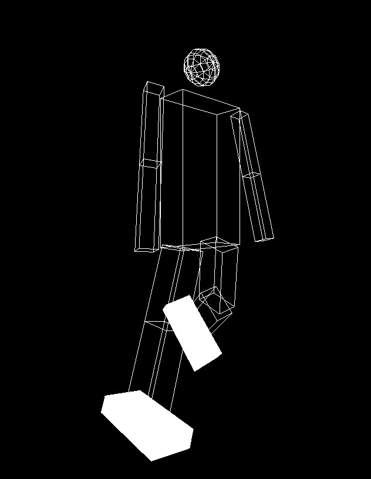

# Computer-Graphics
**Assignment 2**: Robotic Body and Camera movement <h1> 


## Table of Contents

-   [About the Project](#about-the-project)
-   [Changes in code](#changes-in-code)
-   [Issues encountered](#issues-encountered)
-   [Members](#members)

##  About the Project

**Assignment 2: Robotic Body and Camera movement**

-It's required to use the robotic arm designed in assignment 1 and draw a whole body with cubes and sphere for the head, implement all type of movements, and set up camera to move around the body using a mouse or keyboard keys.

##  Changes in code
  
* Designed the body, head, knees, feet, shoulders, elbows, and hips; starting with `glPushMatrix();` and ending with `glPopMatrix();` for separation purposes:

```
    
    //Draw Body
    glPushMatrix(); //original push

    glRotatef(angle2, 1.0, 0.0, 0.0);
    glRotatef(angle, 0.0, 1.0, 0.0);
    glTranslatef(-1.0, 0.0, 0.0);
    glTranslatef(1.0, 1.0, -2.0);

    glPushMatrix(); //1
    glScalef(1.0, 2.0, 0.5);
    glutWireCube(2.0);
    glPopMatrix(); //1

    // Draw Head
    glPushMatrix(); //2

    glTranslatef(-1.0, 3.0, 0.0);
    glTranslatef(1.0, 0.0, 0.0);

    glPushMatrix(); //3
    glScalef(1.0, 1.0, 1.0);
    glutWireSphere(0.5, 10, 8);
    glPopMatrix(); //3

    glPopMatrix(); //2
```

* Adjustments to `glTranslatef()` for each block to fit as a robotic body.


* Added extra constraints to `keyboard()` for all keys to prevent unrealistic motion.


* Added camera zoom in/out keys to `keyboard()`, keys of rotations about the horizontal direction and vertical direction to `specialKeys()` for each block to fit as a robotic body.


 


##  Issues encountered  
  
* After adding the camera keys, we encountered a weird movement and the body disappeared after a couple of rotations. The problem solved by revising the code and making sure we were working on the correct view and the camera-related functions were correctly implemented. 

* One of our friends "Youssef Mohamed" suggested creating a default case for the camera angles and link it with a keyboard key, it was a good idea and now key '0' is responsible for resetting the view angle. 

* Moreover, We Struggled a bit to understand and visualize the whole body with its rotations correctly.


##  Members

* Name: **Hassan Fathi Shelkami**
Sec: 1  |   BN: 28

* Name: **Ammar Elsaeed Mohamed**
Sec: 1  |   BN: 51

* Name: **Mostafa Mohamed Essam**
Sec: 2  |   BN: 27

* Name: **Mostafa Mahmoud Abbas**
Sec: 2  |   BN: 28

* Name: **Yasser Nasser Ahmed**
Sec: 2  |   BN: 45


# Robotic-Body
# Robotic-Body
